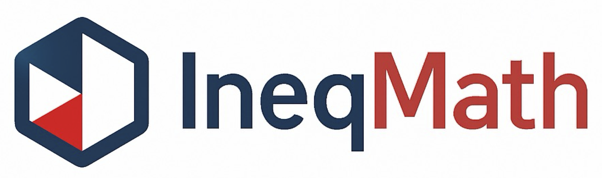
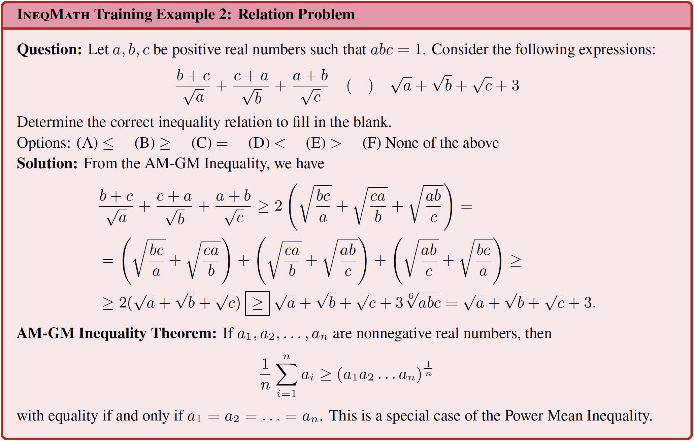
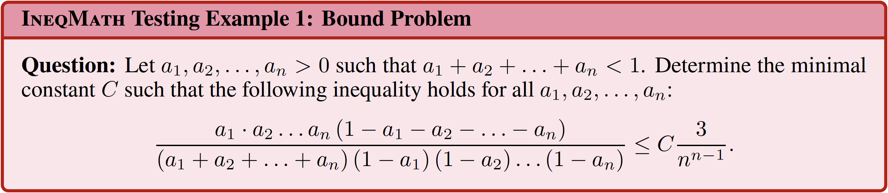
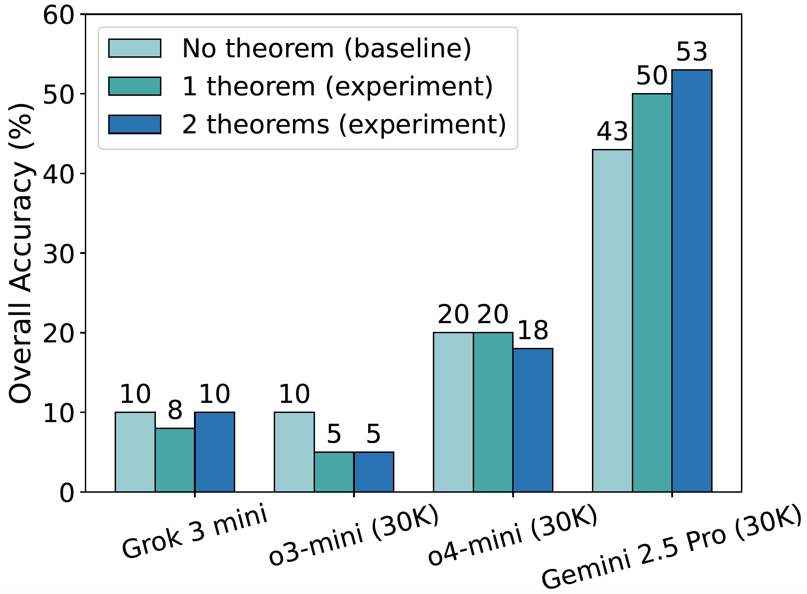

<div align="center">

  

  <!-- <h1 style="font-size: 40px; margin-bottom: 0;"><strong>IneqMath</strong></h1> -->

  <h2 style="font-weight: bold; margin-top: 11px;">
    Solving Inequality Proofs with Large Language Models
  </h2>

  <p>
    <a href="https://ineqmath.github.io/">🌐 Project</a> |
    <a href="https://arxiv.org/abs/2506.07927"> arXiv</a> |
    <a href="https://huggingface.co/papers/2506.07927"> HF Paper</a> |
    <a href="https://huggingface.co/datasets/AI4Math/IneqMath"> Dataset</a> |
    <a href="https://huggingface.co/spaces/AI4Math/IneqMath-Leaderboard">🏆 Leaderboard</a> |
    <a href="https://ineqmath.github.io/#visualization">🔮 Visualization</a>
    
  </p>


</div>

<!-- This is the code repository for the paper [Solving Inequality Proofs with Large Language Models](https://arxiv.org/abs/2506.07927). -->


## Introduction
We propose <b><span style="color:#103756;">Ineq</span><span style="color:#D03C36;">Math</span></b>, an expert-curated dataset of Olympiad-level inequalities, including a test set and a training corpus enriched with **step-wise solutions and theorem annotations**. The dataset follows an **informal yet verifiable** task formulation, recasting inequality proving into two automatically checkable subtasks: **bound estimation** and **relation prediction**. We also develop a novel **LLM-as-judge evaluation framework**, combining a ***final-answer** judge with four **step-wise** judges designed to detect common reasoning flaws.

A systematic evaluation of 29 leading LLMs on <b><span style="color:#103756;">Ineq</span><span style="color:#D03C36;">Math</span></b> reveals a surprising reality: even top models like o1 achieve less than 10% overall accuracy under step-wise scrutiny; this is a drop of up to 65.5% from their accuracy when considering only final answer equivalence. This discrepancy exposes **fragile deductive chains and a critical gap for current LLMs between merely finding an answer and constructing a rigorous proof**. **Scaling model size and increasing test-time computation** yield limited gains in overall proof correctness. Instead, our findings highlight promising research directions such as **theorem-guided reasoning and self-refinement**.

## Dataset Examples
Below are training and testing examples from <b><span style="color:#103756;">Ineq</span><span style="color:#D03C36;">Math</span></b>. Each problem belongs to one of two automatically checkable subtasks: **bound estimation** or **relation prediction**. Each training problem includes **step-wise solutions**, with up to four solutions per problem, and 76.8% (962 problems) are annotated with **relevant theorems**. The test problems are each crafted and reviewed by **IMO-level medalists** to ensure both originality and difficulty.

Training examples of <b><span style="color:#103756;">Ineq</span><span style="color:#D03C36;">Math</span></b>:
<div align="center">
    
    
</div>


Testing examples of <b><span style="color:#103756;">Ineq</span><span style="color:#D03C36;">Math</span></b>:


<div align="center">
    
    
</div>

## 🏆 Leaderboard
The leaderboard of chat and reasoning LLMs on the <b><span style="color:#103756;">Ineq</span><span style="color:#D03C36;">Math</span></b> benchmark (the test set) is shown below. 

The interactive leaderboard for the <b><span style="color:#103756;">Ineq</span><span style="color:#D03C36;">Math</span></b> is available [here](https://huggingface.co/spaces/AI4Math/IneqMath-Leaderboard).

| **Rank** | &nbsp;&nbsp;&nbsp;&nbsp;&nbsp;&nbsp;&nbsp;&nbsp;&nbsp;&nbsp;&nbsp;&nbsp;&nbsp;&nbsp;&nbsp;&nbsp;&nbsp;&nbsp;&nbsp;**Model**&nbsp;&nbsp;&nbsp;&nbsp;&nbsp;&nbsp;&nbsp;&nbsp;&nbsp;&nbsp;&nbsp;&nbsp;&nbsp;&nbsp;&nbsp;&nbsp;&nbsp;&nbsp;&nbsp; | &nbsp;&nbsp;&nbsp;**Size**&nbsp;&nbsp;&nbsp; | **Type** | **Source** | &nbsp;&nbsp;&nbsp;&nbsp;&nbsp;&nbsp;&nbsp;&nbsp;&nbsp;**Date**&nbsp;&nbsp;&nbsp;&nbsp;&nbsp;&nbsp;&nbsp;&nbsp;&nbsp; | **Overall Acc ↓** | **Answer Acc** | **Step Acc (NTC)** | **Step Acc (NLG)** | **Step Acc (NAE)** | **Step Acc (NCE)** |
|------|-------|------|------|--------|------|-------------|------------|----------------|----------------|----------------|----------------|
| 1 | **o3-pro (medium, 40K)🥇** | UNK | 🧠 | 🔒 | 2025-06-10 | **46.0%** | 68.5% | 95.5% | 73.5% | 86.0% | 94.5% |
| 2 | **o3-pro (medium, 10K)🥈** | UNK | 🧠 | 🔒 | 2025-06-10 | **45.5%** | 68.0% | 98.5% | 67.0% | 87.0% | 97.5% |
| 3 | **Gemini 2.5 Pro (30K)🥉** | UNK | 🧠 | 🔒 | 2025-03-25 | **43.5%** | 68.0% | 87.5% | 63.0% | 91.0% | 98.0% |
| 4 | **o3 (medium, 40K)** | UNK | 🧠 | 🔒 | 2025-04-16 | **37.0%** | 72.0% | 96.5% | 56.0% | 86.5% | 94.0% |
| 5 | **Gemini 2.5 Flash (40K)** | UNK | 🧠 | 🔒 | 2025-04-17 | **23.5%** | 44.5% | 81.0% | 36.5% | 93.5% | 97.5% |
| 6 | **o3 (medium)** | UNK | 🧠 | 🔒 | 2025-04-16 | **21.0%** | 37.0% | 93.5% | 39.5% | 91.5% | 97.0% |
| 7 | **o4-mini (medium)** | UNK | 🧠 | 🔒 | 2025-04-16 | **15.5%** | 65.0% | 62.0% | 26.0% | 86.5% | 93.0% |
| 8 | **o3-mini (medium)** | UNK | 🧠 | 🔒 | 2025-01-31 | **9.5%** | 62.5% | 37.0% | 22.0% | 77.5% | 95.0% |
| 9 | **o1 (medium)** | UNK | 🧠 | 🔒 | 2024-12-17 | **8.0%** | 62.5% | 34.5% | 17.5% | 86.5% | 99.5% |
| 10 | **o1 (medium, 40K)** | UNK | 🧠 | 🔒 | 2024-12-17 | **7.5%** | 68.0% | 28.5% | 19.0% | 83.5% | 95.5% |
| 11 | **Grok 3 mini (medium)** | UNK | 🧠 | 🔒 | 2025-02-19 | **6.0%** | 71.5% | 24.0% | 19.5% | 53.5% | 91.0% |
| 12 | **Qwen3-235B-A22B** | 235B | 🧠 | 🌐 | 2025-04-28 | **6.0%** | 41.0% | 35.0% | 36.0% | 31.0% | 92.5% |
| 13 | **Gemini 2.5 Pro** | UNK | 🧠 | 🔒 | 2025-03-25 | **6.0%** | 7.0% | 88.5% | 19.0% | 100.0% | 99.5% |
| 14 | **DeepSeek-R1 (Qwen-14B)** | 14B | 🧠 | 🌐 | 2025-01-20 | **5.0%** | 40.5% | 21.0% | 21.0% | 35.5% | 85.0% |
| 15 | **DeepSeek-R1** | UNK | 🧠 | 🔒 | 2025-01-19 | **5.0%** | 49.5% | 57.0% | 17.5% | 81.0% | 95.0% |
| 16 | **Gemini 2.5 Flash** | UNK | 🧠 | 🔒 | 2025-04-17 | **4.5%** | 5.5% | 88.0% | 13.5% | 100.0% | 100.0% |
| 17 | **Grok 3** | UNK | 📝 | 🔒 | 2025-02-19 | **3.5%** | 54.5% | 17.0% | 16.0% | 36.0% | 93.0% |
| 18 | **DeepSeek-R1 (Llama-70B)** | 70B | 🧠 | 🌐 | 2025-01-20 | **3.5%** | 53.5% | 23.0% | 26.0% | 35.5% | 87.0% |
| 19 | **Gemini 2.0 Flash** | UNK | 📝 | 🔒 | 2025-02-05 | **3.0%** | 49.0% | 15.5% | 13.5% | 55.5% | 94.5% |
| 20 | **Qwen2.5-7B** | 7B | 📝 | 🌐 | 2024-09-16 | **3.0%** | 35.0% | 44.5% | 4.5% | 92.5% | 93.0% |
| 21 | **GPT-4o** | UNK | 📝 | 🔒 | 2024-08-06 | **3.0%** | 37.5% | 32.0% | 3.5% | 92.5% | 94.0% |
| 22 | **GPT-4.1** | UNK | 📝 | 🔒 | 2025-04-14 | **2.5%** | 40.5% | 16.0% | 10.0% | 59.5% | 93.5% |
| 23 | **Qwen2.5-72B** | 72B | 📝 | 🌐 | 2024-09-16 | **2.5%** | 42.0% | 54.5% | 5.0% | 91.0% | 95.0% |
| 24 | **Llama-4-Maverick** | 128 x 17B | 📝 | 🌐 | 2025-04-05 | **2.5%** | 40.5% | 42.5% | 4.0% | 89.0% | 95.0% |
| 25 | **Claude 3.7 Sonnet** | UNK | 🧠 | 🔒 | 2025-02-19 | **2.0%** | 42.0% | 49.0% | 4.0% | 93.5% | 93.0% |
| 26 | **QwQ-32B** | 32B | 🧠 | 🌐 | 2025-03-05 | **2.0%** | 49.5% | 26.0% | 29.5% | 21.0% | 87.0% |
| 27 | **QwQ-32B-preview** | 32B | 🧠 | 🌐 | 2024-11-27 | **2.0%** | 43.5% | 28.0% | 30.0% | 22.5% | 87.5% |
| 28 | **GPT-4o mini** | UNK | 📝 | 🔒 | 2024-07-18 | **2.0%** | 39.5% | 29.0% | 2.5% | 90.0% | 93.0% |
| 29 | **Qwen2.5-Coder-32B** | 32B | 📝 | 🌐 | 2024-11-10 | **1.5%** | 40.5% | 36.0% | 3.0% | 90.5% | 88.5% |
| 30 | **Gemini 2.0 Flash-Lite** | UNK | 📝 | 🔒 | 2025-02-25 | **1.5%** | 33.0% | 11.5% | 3.5% | 73.0% | 90.5% |
| 31 | **Qwen2.5-Coder-32B** | 32B | 📝 | 🌐 | 2024-11-10 | **1.5%** | 40.5% | 36.0% | 3.0% | 90.5% | 88.5% |
| 32 | **Llama-4-Scout** | 16 x 17B | 📝 | 🌐 | 2025-04-05 | **1.5%** | 33.5% | 30.5% | 3.5% | 93.0% | 92.5% |
| 33 | **Claude 3.7 Sonnet (8K)** | UNK | 🧠 | 🔒 | 2025-02-19 | **1.0%** | 41.5% | 49.0% | 2.5% | 93.5% | 92.0% |
| 34 | **DeepSeek-R1 (Qwen-14B)** | 1.5B | 🧠 | 🌐 | 2025-01-20 | **0.5%** | 14.5% | 20.0% | 6.0% | 48.0% | 83.5% |
| 35 | **Gemma-2B (6K)** | 2B | 📝 | 🌐 | 2024-02-21 | **0.0%** | 7.5% | 73.5% | 0.0% | 99.0% | 95.0% |
| 36 | **Llama-3.1-8B** | 8B | 📝 | 🌐 | 2024-07-18 | **0.0%** | 14.5% | 90.5% | 0.0% | 99.0% | 92.0% |
| 37 | **Gemma-2-9B (6K)** | 9B | 📝 | 🌐 | 2024-06-25 | **0.0%** | 15.5% | 83.5% | 0.5% | 100.0% | 99.0% |
| 38 | **Llama-3.2-3B** | 3B | 📝 | 🌐 | 2024-09-25 | **0.0%** | 11.0% | 82.0% | 0.0% | 98.5% | 88.5% |

The content in parentheses next to the model's name represents reasoning effort and the max tokens, respectively, with the default value for max tokens being 10K.

**Icons Explanation**:
- **Type**: 🧠 = Reasoning Model, 📝 = Chat Model, 🔧 = Tool-augmented Model
- **Source**: 🔒 = Proprietary Model, 🌐 = Open-source Model

**Step Accuracy Abbreviations:**
- **NTC**: No Toy Case - Step accuracy excluding using toy-case for general conclusions
- **NLG**: No Logical Gap - Step accuracy without logical reasoning gaps
- **NAE**: No Approximation Error - Step accuracy excluding approximation errors
- **NCE**: No Calculation Error - Step accuracy excluding all calculation errors

## Environment Setup

Set up conda environment:

```bash
conda create --name ineq python=3.10

conda activate ineq

```
If you fail to activate the environment, please try:
```bash
# Alternatively, use source activate
source activate ineq
```


Install dependencies and make `.env` file:

```bash
pip install -r requirements.txt
touch .env
```


Set your API keys in the `.env` file. For example:

```sh
OPENAI_API_KEY=your-OpenAI-api-key-here
DEEPSEEk_API_KEY=your-DeepSeek-api-key-here
ANTHROPIC_API_KEY=your-Anthropic-api-key-here
```


## Evaluate models on <b><span style="color:#103756;">Ineq</span><span style="color:#D03C36;">Math</span></b> test set
Change the directory to `models/scripts`:
```bash
cd models/scripts
```

Run `run_test_data_proprietary_all.sh`, `run_test_data_open_source_all.sh`, and `run_test_data_gemma.sh` to evaluate all the models used in our paper's experiments on the test set.
```bash
./run_test_data_proprietary_all.sh
./run_test_data_open_source_all.sh
./run_test_data_gemma.sh
```

If the dataset can't be loaded automatically, please download the json form dataset manually by:
```shell
mkdir ../../data
cd ../../data
wget https://huggingface.co/datasets/AI4Math/IneqMath/resolve/main/json/all.tar.gz
tar -zxvf all.tar.gz
```

If you want to run other models on our test set, you could subtitute the model engine name in `ENGINES` of the `.sh` file, and then run it.


## Submit the results to the leaderboard
🏆 The leaderboard for the <b><span style="color:#103756;">Ineq</span><span style="color:#D03C36;">Math</span></b> is available [here](https://huggingface.co/spaces/AI4Math/IneqMath-Leaderboard).

If you run the model by our scripts, you can find the results in `results models_results_test_data/` and upload the `results.json` of the model to the leaderboard.

If you run the model on your own, please check your data format before your submission. The submitted data should be compiled in a single `json` file with at least five keys listed below:

```
{
    "data_id": [integer or string] The ID of the data of each split,
    "problem": [string] The question text,
    "type": [string] The type of question: 'relation' or 'bound',
    "prompt": [string] The prompt used for the problem,
    "response": [string] The response of the model
}
```
## Dataset Overview
The <b><span style="color:#103756;">Ineq</span><span style="color:#D03C36;">Math</span></b> dataset comprises 200 test problems for benchmarking, 100 development problems with public ground truth, and 1,252 training problems split evenly between **bound estimation** and **relation prediction** tasks as shown in the table below. The dataset also features 83 named theorems across 29 categories, with their distribution illustrated in the figure below.
<center>
  <table 
    align="center" 
    width="60%" 
    border="1" 
    cellspacing="0" 
    cellpadding="6"
    style="width:60%; table-layout: fixed; border-collapse: collapse; text-align: center;">
    <colgroup>
      <col width="64%">
      <col width="12%">
      <col width="12%">
      <col width="12%">
    </colgroup>
    <thead>
      <tr>
        <th style="text-align:left;">Statistic</th>
        <th>Number</th>
        <th>Bnd.</th>
        <th>Rel.</th>
      </tr>
    </thead>
    <tbody>
      <tr>
        <td style="text-align:left;"><b>Theorem categories</b></td>
        <td>29</td>
        <td>–</td>
        <td>–</td>
      </tr>
      <tr style="border-bottom:2px solid #000;">
        <td style="text-align:left;"><b>Named theorems</b></td>
        <td>83</td>
        <td>–</td>
        <td>–</td>
      </tr>
      <tr>
        <td style="text-align:left;"><b>Training problems (for training)</b></td>
        <td>1252</td>
        <td>626</td>
        <td>626</td>
      </tr>
      <tr>
        <td style="text-align:left;">&nbsp;&nbsp;&nbsp;&nbsp;&nbsp;&nbsp;&nbsp;&nbsp;- With theorem annotations</td>
        <td>962</td>
        <td>482</td>
        <td>480</td>
      </tr>
      <tr>
        <td style="text-align:left;">&nbsp;&nbsp;&nbsp;&nbsp;&nbsp;&nbsp;&nbsp;&nbsp;- With solution annotations</td>
        <td>1252</td>
        <td>626</td>
        <td>626</td>
      </tr>
      <tr>
        <td style="text-align:left;">&nbsp;&nbsp;&nbsp;&nbsp;&nbsp;&nbsp;&nbsp;&nbsp;- Avg. solutions per problem</td>
        <td>1.05</td>
        <td>1.06</td>
        <td>1.05</td>
      </tr>
      <tr style="border-bottom:2px solid #000;">
        <td style="text-align:left;">&nbsp;&nbsp;&nbsp;&nbsp;&nbsp;&nbsp;&nbsp;&nbsp;- Max solutions per problem</td>
        <td>4</td>
        <td>4</td>
        <td>4</td>
      </tr>
      <tr>
        <td style="text-align:left;"><b>Dev problems (for development)</b></td>
        <td>100</td>
        <td>50</td>
        <td>50</td>
      </tr>
      <tr>
        <td style="text-align:left;"><b>Test problems (for benchmarking)</b></td>
        <td>200</td>
        <td>96</td>
        <td>104</td>
      </tr>
    </tbody>
  </table>
</center>
<br>

<div align="center">

  

</div>

The table below compares datasets for inequalities and theorem proving. <b><span style="color:#103756;">Ineq</span><span style="color:#D03C36;">Math</span></b> provides expert-annotated training and test/dev sets, featuring high-quality named theorems and step-wise solutions for model development. Unlike prior datasets that use synthesis or autoformalization, <b><span style="color:#103756;">Ineq</span><span style="color:#D03C36;">Math</span></b> presents problems in informal language across both multiple-choice (MC) and open-ended (Open) formats, and employs LLM-as-judge for evaluation.

<div align="center">

</div>

## Fine-grained Informal Judges

Traditional evaluation methods fall short in this setting: expert annotation is accurate but prohibitively labor-intensive, while automated techniques such as string matching or value equivalence fail to capture step-by-step correctness—an essential aspect of inequality problem solving. To evaluate the correctness of <b><span style="color:#103756;">Ineq</span><span style="color:#D03C36;">Math</span></b> solutions, we propose a fine-grained **LLM-as-judge** framework, consisting of a **final-answer judge** for verifying the predicted answer and four specialized **step-wise judges** targeting common reasoning flaws. A solution is deemed correct **overall** only if it passes all five judges. As shown in the following table and confusion matrix, these judges achieve strong alignment with human annotations (F1 = 0.93), providing a scalable yet reliable alternative to manual evaluation.

<div align="center">

  
  

</div>

## Results of leading LLMs
This table shows the **Final-answer accuracy** versus **overall accuracy** for leading LLMs across different categories on the <b><span style="color:#103756;">Ineq</span><span style="color:#D03C36;">Math</span></b> benchmark of Olympiad-level inequality problems. Overall accuracy, measuring both answer correctness and step soundness, is substantially lower than final-answer accuracy for all model types. This highlights a critical gap: while LLMs may find correct final answers to these inequality problems, their reasoning is often unsound. Each model used its optimal maximal tokens.

<div align="center">

  

</div>

## Scaling law in model size
The following two figures show how <em>final-answer accuracy</em> (which evaluates only the correctness of the final predicted answer) and <em>overall accuracy</em> (which requires both a correct answer and valid intermediate reasoning steps) scales with model size for LLMs.

The figure below shows how final-answer accuracy (which evaluates only the correctness of the final predicted answer) scales with model size for LLMs. As model size increases, we observe a steady improvement in answer accuracy, reflecting an empirical scaling law that larger models are better at inferring correct bounds and inequality relationships.
<div align="center">

  

</div>

 However, the trend for answer accuracy does not hold well when considering overall accuracy—which requires both a correct answer and valid intermediate reasoning steps—as shown in the figure below. In this case, the scaling curve flattens, indicating that increased model size alone is insufficient to eliminate step-by-step reasoning errors.

<div align="center">
  

</div>

## Retrieving relevant theorems as hints
As shown in the figure, providing one or two such theorems decreases overall accuracy for weaker models (e.g., Grok 3 mini, o3-mini, o4-mini), likely due to misapplication or distraction by potentially irrelevant information. Conversely, stronger models like Gemini 2.5 Pro benefit from these hints, suggesting advanced reasoning is crucial to effectively use such guidance. These results underscore the potential of theorem-guided reasoning but also highlight the critical need for more sophisticated theorem retrieval mechanisms (e.g., RAG) to reliably enhance LLM performance in inequality proving.

<div align="center">

</div>

## Self-improvement via critic as feedback
As the figure shows, self-critique consistently improves performance—e.g., Gemini 2.5 Pro's overall accuracy rises from 43% to 48%. This upward trend underscores self-critique as a promising, supervision-free method to enhance logical rigor and solution quality of LLMs in inequality reasoning.

<div align="center">

</div>

## License

The new contributions to our dataset are distributed under the [CC BY-SA 4.0](https://creativecommons.org/licenses/by-sa/4.0/) license.

The copyright of the images and the questions belongs to the original authors. Alongside this license, the following conditions apply:

- **Purpose:** The test split was primarily designed for use as a test set.
- **Commercial Use:** The test split can be used commercially as a test set, but using it as a training set is prohibited. By accessing or using this dataset, you acknowledge and agree to abide by these terms in conjunction with the [CC BY-SA 4.0](https://creativecommons.org/licenses/by-sa/4.0/) license.

## Citation

If you use the <b><span style="color:#103756;">Ineq</span><span style="color:#D03C36;">Math</span></b> dataset in your work, please kindly cite the paper using this BibTeX:

```
@article{jiayi2025solving,
    author = {Jiayi, Sheng and Luna, Lyu and Jikai, Jin and Tony, Xia and Alex, Gu and James, Zou and Pan, Lu},
    title = {Solving Inequality Proofs with Large Language Models},
    journal = {arXiv preprint arXiv:2506.07927},
    year = {2025}
}
```

