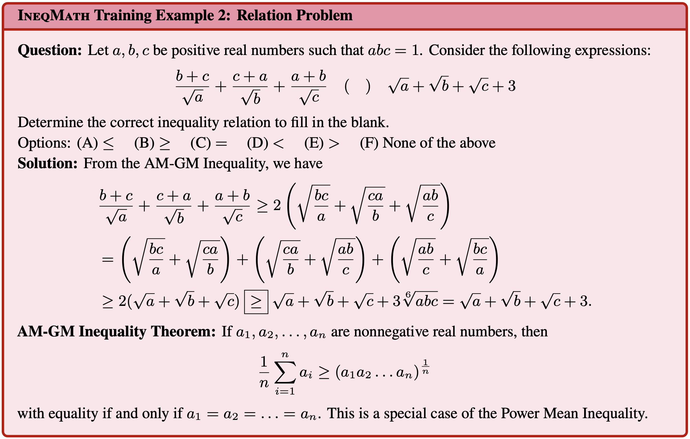

<div align="center">

  

  <!-- <h1 style="font-size: 40px; margin-bottom: 0;"><strong>IneqMath</strong></h1> -->

  <h2 style="font-weight: bold; margin-top: 11px;">
    Solving Inequality Proofs with Large Language Models
  </h2>

  <!-- <p>
    <a href="https://ineqmath.github.io/">🌐 Project</a> |
    <a href="https://arxiv.org/abs/2506.07927"> arXiv</a> |
    <a href="https://huggingface.co/papers/2506.07927"> HF Paper</a> |
    <a href="https://huggingface.co/datasets/AI4Math/IneqMath"> Dataset</a> |
    <a href="https://huggingface.co/spaces/AI4Math/IneqMath-Leaderboard">🏆 Leaderboard</a> |
    <a href="https://ineqmath.github.io/#visualization">🔮 Visualization</a>
    
  </p> -->
  <!--- BADGES: START --->
[](https://lbesson.mit-license.org/)
[](https://creativecommons.org/licenses/by-sa/4.0/)
[](https://arxiv.org/abs/2506.07927)
[](https://huggingface.co/papers/2506.07927)
[](https://huggingface.co/datasets/AI4Math/IneqMath)
</br>
[](https://ineqmath.github.io/)
[](https://huggingface.co/spaces/AI4Math/IneqMath-Leaderboard)
[](https://ineqmath.github.io/#visualization)
[](https://x.com/lupantech/status/1932866286427779586)


<!--- BADGES: END --->

</div>

<!-- This is the code repository for the paper [Solving Inequality Proofs with Large Language Models](https://arxiv.org/abs/2506.07927). -->


Welcome to the official repository for the paper "[Solving Inequality Proofs with Large Language Models](https://arxiv.org/abs/2506.07927)". With this toolkit you can **evaluate your own models** on our benchmark, **plug in our improvement strategies** to boost performance, **reproduce the paper's experiments** end-to-end, and **train more effectively** with our data. 

**Dive in and push the frontier of inequality and mathematics reasoning with us!** 🚀


## 📑 Table of Contents

- [💥 News ](#news)
- [📖 Introduction](#introduction)
- [📊 Dataset Examples](#dataset-examples)
- [🏆 Leaderboard](#leaderboard)
- [📝 Evaluations on IneqMath](#evaluations-on-ineqmath)
  - [Environment Setup](#environment-setup)
  - [Evaluate Models on IneqMath Test Set](#evaluate-models-on-ineqmath-test-set)
  - [Evaluate Models on IneqMath Dev Set](#evaluate-models-on-ineqmath-dev-set)
  - [Evaluate with the Final Answer Judge](#evaluate-with-the-final-answer-judge)
  - [Submit the Results to the Leaderboard](#submit-the-results-to-the-leaderboard)
- [🎯 Strategies on IneqMath](#strategies-on-ineqmath)
  - [Frequent Theorems as Hints](#frequent-theorems-as-hints)
  - [Frequent Training Problems and Solutions as Hints](#frequent-training-problems-and-solutions-as-hints)
  - [Few-shot Evaluation](#few-shot-evaluation)
- [🧪 Other experiments on IneqMath](#other-experiments-on-ineqmath)
  - [Taking Annotated Theorems as Hints](#taking-annotated-theorems-as-hints)
- [🤖 Supported LLM Engines](#supported-llm-engines)
- [📂 Data Curation](#data-curation)
  - [Informal Reformulation of Inequality Proving](#informal-reformulation-of-inequality-proving)
  - [Training Data Enhancement](#training-data-enhancement)
- [🤗 Dataset Overview](#dataset-overview)
- [🧐 Fine-grained Informal Judges](#fine-grained-informal-judges)
- [📈 Evaluation Results](#evaluation-results)
  - [Results of Leading LLMs](#results-of-leading-llms)
  - [Scaling Law in Model Size](#scaling-law-in-model-size)
- [🔍 In-depth Study](#in-depth-study)
  - [Retrieving Relevant Theorems as Hints](#retrieving-relevant-theorems-as-hints)
  - [Self-improvement via Critic as Feedback](#self-improvement-via-critic-as-feedback)
- [📜 License](#license)
- [📚 Citation](#citation)

<a id="news"></a>
## 💥 News 

- **[2025.08.18]** 🎯 We've just released our novel **reformulation pipeline** that transforms inequality proofs into **informal yet verifiable subtasks**. Plus, our brand-new **training data enhancement scripts** are here to supercharge your model training. Check out our [Data Curation](#data-curation) section and start building better data and models today! ✨
- **[2025.08.17]** 🚀 Supercharge your IneqMath runs with our new improvement strategies—[Frequent Theorems as Hints](#frequent-theorems-as-hints), [Frequent Training Problems & Solutions as Hints](#frequent-training-problems-and-solutions-as-hints), and [Few-shot Evaluation](#few-shot-evaluation). Give them a try and let us know if there are other strategies you'd like to see!
- **[2025.08.16]** 🚀 Updated **example scripts** across **all supported model families**—explore them [here](#supported-llm-engines)!
- **[2025.08.14]** ✨ Released the **dev set evaluation scripts** and our **Final Answer Judge**—try them now! [Dev set evaluation](#evaluate-models-on-ineqmath-dev-set) | [Final Answer Judge](#evaluate-with-the-final-answer-judge).
- **[2025.08.08]** 💥 **GPT-5 (medium, 30K)** 🥇 Sets New SOTA on IneqMath with overall accuracy **47.0%**! Read more on the [OpenAI Platform](https://openai.com/index/introducing-gpt-5/).
- **[2025.07.25]** ✨ Released our **dev set evaluation platform** to help you fine-tune models more effectively! Get started: [Dev set evaluation platform](https://huggingface.co/spaces/AI4Math/IneqMath-Dev-Evaluation).
- **[2025.07.19]** 📄 Added support for vLLM. You can now use any vLLM-supported models and your local checkpoint models. Check out the [example scripts](#supported-llm-engines) for more details.
- **[2025.07.18]** 🎉 Our paper has been accepted to the [2nd AI for Math Workshop](https://sites.google.com/view/ai4mathworkshopicml2025/accepted-papers?authuser=0) at ICML 2025—read the [paper](https://openreview.net/forum?id=cB9eZUINSh#discussion) and view the [poster](assets/others/icml_poster.pdf)!
- **[2025.06.16]** 💥 o3-pro (40K) 🥇 Sets New SOTA on IneqMath with overall accuracy 46.0%! Read more on the [OpenAI Platform](https://platform.openai.com/docs/models/o3-pro?ref=blog.roboflow.com).
- **[2025.06.11]** Our work is featured by [Pan Lu](https://x.com/lupantech) on [Twitter](https://x.com/lupantech/status/1932866286427779586)!
- **[2025.06.09]** Our paper is now accessible at https://arxiv.org/abs/2506.07927.


<a id="introduction"></a>
## 📖 Introduction
Inequality proving, crucial across diverse scientific and mathematical fields, tests advanced reasoning skills such as discovering tight bounds and strategic theorem application. LLM's progress in this area is hampered by existing datasets that are often scarce, synthetic, or rigidly formal. We address this by proposing an <b>informal yet verifiable</b> task formulation, recasting inequality proving into two automatically checkable subtasks: <b>bound estimation</b> and <b>relation prediction</b>. 

Building on this, we propose <b><span style="color:#103756;">Ineq</span><span style="color:#D03C36;">Math</span></b>, an expert-curated dataset of Olympiad-level inequalities, including a test set and a training corpus enriched with **stepwise solutions and theorem annotations**. We also develop a novel **LLM-as-judge evaluation framework**, combining a **final-answer** judge with four **stepwise** judges designed to detect common reasoning flaws. **Thus, we can assess LLMs’ informal reasoning abilities, where they generally perform well, even though they consistently struggle with formal problem solving.**

A systematic evaluation of 29 leading LLMs on <b><span style="color:#103756;">Ineq</span><span style="color:#D03C36;">Math</span></b> reveals a surprising reality: even top models like o1 achieve less than 10% overall accuracy under stepwise scrutiny; this is a drop of up to 65.5% from their accuracy when considering only final answer equivalence. This discrepancy exposes **fragile deductive chains and a critical gap for current LLMs between merely finding an answer and constructing a rigorous proof**. **Scaling model size and increasing test-time computation** yield limited gains in overall proof correctness. Instead, our findings highlight promising research directions such as **theorem-guided reasoning and self-refinement**.

<a id="dataset-examples"></a>
## 📊 Dataset Examples
Below are training and testing examples from <b><span style="color:#103756;">Ineq</span><span style="color:#D03C36;">Math</span></b>. Each problem belongs to one of two automatically checkable subtasks: **bound estimation** or **relation prediction**. Each training problem includes **stepwise solutions**, with up to four solutions per problem, and 76.8% (962 problems) are annotated with **relevant theorems**. The test problems are each crafted and reviewed by **IMO-level medalists** to ensure both originality and difficulty.

Training examples of <b><span style="color:#103756;">Ineq</span><span style="color:#D03C36;">Math</span></b>:
<div align="center">
    
    
</div>


Testing examples of <b><span style="color:#103756;">Ineq</span><span style="color:#D03C36;">Math</span></b>:


<div align="center">
    
    
</div>

<a id="leaderboard"></a>
## 🏆 Leaderboard
The leaderboard of chat and reasoning LLMs on the <b><span style="color:#103756;">Ineq</span><span style="color:#D03C36;">Math</span></b> benchmark (the test set) is shown below. 

The interactive leaderboard for the <b><span style="color:#103756;">Ineq</span><span style="color:#D03C36;">Math</span></b> is available [here](https://huggingface.co/spaces/AI4Math/IneqMath-Leaderboard).

| **Rank** | &nbsp;&nbsp;&nbsp;&nbsp;&nbsp;&nbsp;&nbsp;&nbsp;&nbsp;&nbsp;&nbsp;&nbsp;&nbsp;&nbsp;&nbsp;&nbsp;&nbsp;&nbsp;&nbsp;**Model**&nbsp;&nbsp;&nbsp;&nbsp;&nbsp;&nbsp;&nbsp;&nbsp;&nbsp;&nbsp;&nbsp;&nbsp;&nbsp;&nbsp;&nbsp;&nbsp;&nbsp;&nbsp;&nbsp; | &nbsp;&nbsp;&nbsp;**Size**&nbsp;&nbsp;&nbsp; | **Type** | **Source** | &nbsp;&nbsp;&nbsp;&nbsp;&nbsp;&nbsp;&nbsp;&nbsp;&nbsp;**Date**&nbsp;&nbsp;&nbsp;&nbsp;&nbsp;&nbsp;&nbsp;&nbsp;&nbsp; | **Overall Acc ↓** | **Answer Acc** | **Step Acc (NTC)** | **Step Acc (NLG)** | **Step Acc (NAE)** | **Step Acc (NCE)** |
|------|-------|------|------|--------|------|-------------|------------|----------------|----------------|----------------|----------------|
| 1 🥇 | **GPT-5 (medium, 30K)** | UNK | 🧠 | 🔒 | 2025-08-07 | **47.0%** | 66.5% | 95.5% | 69.0% | 93.5% | 98.0% |
| 2 🥈 | **o3-pro (medium, 40K)** | UNK | 🧠 | 🔒 | 2025-06-10 | **46.0%** | 68.5% | 95.5% | 73.5% | 86.0% | 94.5% |
| 3 🥉 | **Gemini 2.5 Pro Preview (40K)** | UNK | 🧠 | 🔒 | 2025-06-05 | **46.0%** | 66.0% | 85.0% | 65.0% | 92.5% | 97.5% |
| 4 | **o3-pro (medium, 10K)** | UNK | 🧠 | 🔒 | 2025-06-10 | **45.5%** | 68.0% | 98.5% | 67.0% | 87.0% | 97.5% |
| 5 | **Gemini 2.5 Pro (30K)** | UNK | 🧠 | 🔒 | 2025-03-25 | **43.5%** | 68.0% | 87.5% | 63.0% | 91.0% | 98.0% |
| 6 | **o3 (medium, 40K)** | UNK | 🧠 | 🔒 | 2025-04-16 | **37.0%** | 72.0% | 96.5% | 56.0% | 86.5% | 94.0% |
| 7 | **GPT-5 mini (medium, 10K)** | UNK | 🧠 | 🔒 | 2025-08-07 | **30.5%** | 55.5% | 95.5% | 50.0% | 91.0% | 98.5% |
| 8 | **GPT-5 (medium, 10K)** | UNK | 🧠 | 🔒 | 2025-08-07 | **28.0%** | 36.5% | 94.5% | 47.0% | 93.5% | 97.0% |
| 9 | **Gemini 2.5 Flash Preview 05-20 (40K)** | UNK | 🧠 | 🔒 | 2025-05-20 | **27.5%** | 45.0% | 83.0% | 44.0% | 89.0% | 96.0% |
| 10 | **gpt-oss-120b (10K)** | 120B | 🧠 | 🌐 | 2025-08-05 | **23.5%** | 66.5% | 95.5% | 40.0% | 90.5% | 93.5% |
| 11 | **Gemini 2.5 Flash (40K)** | UNK | 🧠 | 🔒 | 2025-04-17 | **23.5%** | 44.5% | 81.0% | 36.5% | 93.5% | 97.5% |
| 12 | **o3 (medium, 10K)** | UNK | 🧠 | 🔒 | 2025-04-16 | **21.0%** | 37.0% | 93.5% | 39.5% | 91.5% | 97.0% |
| 13 | **DeepSeek-V3.1 (Thinking Mode) (30K)** | 671B | 🧠 | 🌐 | 2025-08-21 | **15.5%** | 73.0% | 52.0% | 31.0% | 64.5% | 94.5% |
| 14 | **o4-mini (medium, 10K)** | UNK | 🧠 | 🔒 | 2025-04-16 | **15.5%** | 65.0% | 62.0% | 26.0% | 86.5% | 93.0% |
| 15 | **Gemini 2.5 Flash Preview 05-20 (10K)** | UNK | 🧠 | 🔒 | 2025-05-20 | **14.5%** | 17.5% | 82.0% | 31.0% | 96.5% | 95.5% |
| 16 | **DeepSeek-V3.1 (Thinking Mode) (10K)** | 671B | 🧠 | 🌐 | 2025-08-21 | **12.0%** | 32.5% | 76.5% | 27.0% | 88.0% | 97.5% |
| 17 | **Gemini 2.5 Pro Preview (10K)** | UNK | 🧠 | 🔒 | 2025-06-05 | **10.0%** | 13.0% | 91.0% | 20.0% | 98.0% | 98.5% |
| 18 | **DeepSeek-R1-0528 (40K)** | 671B | 🧠 | 🌐 | 2025-05-28 | **9.5%** | 73.0% | 49.0% | 52.0% | 20.0% | 92.5% |
| 19 | **o3-mini (medium, 10K)** | UNK | 🧠 | 🔒 | 2025-01-31 | **9.5%** | 62.5% | 37.0% | 22.0% | 77.5% | 95.0% |
| 20 | **Kimi K2 Instruct** | 1000B | 📝 | 🌐 | 2025-07-12 | **9.0%** | 62.5% | 33.5% | 25.5% | 52.5% | 93.0% |
| 21 | **Grok 4 (40K)** | UNK | 🧠 | 🔒 | 2025-07-09 | **8.0%** | 76.0% | 57.0% | 14.0% | 93.0% | 96.5% |
| 22 | **o1 (medium, 10K)** | UNK | 🧠 | 🔒 | 2024-12-17 | **8.0%** | 62.5% | 34.5% | 17.5% | 86.5% | 99.5% |
| 23 | **o1 (medium, 40K)** | UNK | 🧠 | 🔒 | 2024-12-17 | **7.5%** | 68.0% | 28.5% | 19.0% | 83.5% | 95.5% |
| 24 | **DeepSeek-V3-0324** | 671B | 📝 | 🌐 | 2025-03-25 | **7.0%** | 54.5% | 17.5% | 15.0% | 63.0% | 94.5% |
| 25 | **Grok 3 mini (medium, 10K)** | UNK | 🧠 | 🔒 | 2025-02-19 | **6.0%** | 71.5% | 24.0% | 19.5% | 53.5% | 91.0% |
| 26 | **Qwen3-235B-A22B (10K)** | 235B | 🧠 | 🌐 | 2025-04-28 | **6.0%** | 41.0% | 35.0% | 36.0% | 31.0% | 92.5% |
| 27 | **Gemini 2.5 Pro (10K)** | UNK | 🧠 | 🔒 | 2025-03-25 | **6.0%** | 7.0% | 88.5% | 19.0% | 100.0% | 99.5% |
| 28 | **Claude Opus 4 (10K)** | UNK | 🧠 | 🔒 | 2025-05-14 | **5.5%** | 47.5% | 25.0% | 9.0% | 89.5% | 94.0% |
| 29 | **Qwen3-4B** | 4B | 📝 | 🌐 | 2025-04-27 | **5.5%** | 44.0% | 21.0% | 21.0% | 32.0% | 85.5% |
| 30 | **DeepSeek-R1 (10K)** | 671B | 🧠 | 🌐 | 2025-01-19 | **5.0%** | 49.5% | 57.0% | 17.5% | 81.0% | 95.0% |
| 31 | **DeepSeek-R1 (Qwen-14B) (10K)** | 14B | 🧠 | 🌐 | 2025-01-20 | **5.0%** | 40.5% | 21.0% | 21.0% | 35.5% | 85.0% |
| 32 | **DeepSeek-R1-0528 (10K)** | 671B | 🧠 | 🌐 | 2025-05-28 | **4.5%** | 12.0% | 34.0% | 32.5% | 29.0% | 90.5% |
| 33 | **Gemini 2.5 Flash (10K)** | UNK | 🧠 | 🔒 | 2025-04-17 | **4.5%** | 5.5% | 88.0% | 13.5% | 100.0% | 100.0% |
| 34 | **Grok 3** | UNK | 📝 | 🔒 | 2025-02-19 | **3.5%** | 54.5% | 17.0% | 16.0% | 36.0% | 93.0% |
| 35 | **DeepSeek-R1 (Llama-70B) (10K)** | 70B | 🧠 | 🌐 | 2025-01-20 | **3.5%** | 53.5% | 23.0% | 26.0% | 35.5% | 87.0% |
| 36 | **Gemini 2.0 Flash** | UNK | 📝 | 🔒 | 2025-02-05 | **3.0%** | 49.0% | 15.5% | 13.5% | 55.5% | 94.5% |
| 37 | **Claude Sonnet 4 (10K)** | UNK | 🧠 | 🔒 | 2025-05-14 | **3.0%** | 44.0% | 19.5% | 6.5% | 86.5% | 95.5% |
| 38 | **GPT-4o** | UNK | 📝 | 🔒 | 2024-08-06 | **3.0%** | 37.5% | 32.0% | 3.5% | 92.5% | 94.0% |
| 39 | **Qwen2.5-7B** | 7B | 📝 | 🌐 | 2024-09-16 | **3.0%** | 35.0% | 44.5% | 4.5% | 92.5% | 93.0% |
| 40 | **Qwen2.5-72B** | 72B | 📝 | 🌐 | 2024-09-16 | **2.5%** | 42.0% | 54.5% | 5.0% | 91.0% | 95.0% |
| 41 | **GPT-4.1** | UNK | 📝 | 🔒 | 2025-04-14 | **2.5%** | 40.5% | 16.0% | 10.0% | 59.5% | 93.5% |
| 42 | **Llama-4-Maverick** | 128 x 17B | 📝 | 🌐 | 2025-04-05 | **2.5%** | 40.5% | 42.5% | 4.0% | 89.0% | 95.0% |
| 43 | **QwQ-32B (10K)** | 32B | 🧠 | 🌐 | 2025-03-05 | **2.0%** | 49.5% | 26.0% | 29.5% | 21.0% | 87.0% |
| 44 | **QwQ-32B-preview (10K)** | 32B | 🧠 | 🌐 | 2024-11-27 | **2.0%** | 43.5% | 28.0% | 30.0% | 22.5% | 87.5% |
| 45 | **Claude 3.7 Sonnet (10K)** | UNK | 🧠 | 🔒 | 2025-02-19 | **2.0%** | 42.0% | 49.0% | 4.0% | 93.5% | 93.0% |
| 46 | **GPT-4o mini** | UNK | 📝 | 🔒 | 2024-07-18 | **2.0%** | 39.5% | 29.0% | 2.5% | 90.0% | 93.0% |
| 47 | **Qwen2.5-Coder-32B** | 32B | 📝 | 🌐 | 2024-11-10 | **1.5%** | 40.5% | 36.0% | 3.0% | 90.5% | 88.5% |
| 48 | **Llama-4-Scout** | 16 x 17B | 📝 | 🌐 | 2025-04-05 | **1.5%** | 33.5% | 30.5% | 3.5% | 93.0% | 92.5% |
| 49 | **Gemini 2.0 Flash-Lite** | UNK | 📝 | 🔒 | 2025-02-25 | **1.5%** | 33.0% | 11.5% | 3.5% | 73.0% | 90.5% |
| 50 | **Claude 3.7 Sonnet (8K)** | UNK | 🧠 | 🔒 | 2025-02-19 | **1.0%** | 41.5% | 49.0% | 2.5% | 93.5% | 92.0% |
| 51 | **DeepSeek-R1 (Qwen-1.5B) (10K)** | 1.5B | 🧠 | 🌐 | 2025-01-20 | **0.5%** | 14.5% | 20.0% | 6.0% | 48.0% | 83.5% |
| 52 | **Gemma-2-9B (6K)** | 9B | 📝 | 🌐 | 2024-06-25 | **0.0%** | 15.5% | 83.5% | 0.5% | 100.0% | 99.0% |
| 53 | **Llama-3.1-8B** | 8B | 📝 | 🌐 | 2024-07-18 | **0.0%** | 14.5% | 90.5% | 0.0% | 99.0% | 92.0% |
| 54 | **Llama-3.2-3B** | 3B | 📝 | 🌐 | 2024-09-25 | **0.0%** | 11.0% | 82.0% | 0.0% | 98.5% | 88.5% |
| 55 | **Gemma-2B (6K)** | 2B | 📝 | 🌐 | 2024-02-21 | **0.0%** | 7.5% | 73.5% | 0.0% | 99.0% | 95.0% |

The content in parentheses next to the model's name represents reasoning effort and the max tokens, respectively, with the default value for max tokens being 10K.

**Icons Explanation**:
- **Type**: 🧠 = Reasoning Model, 📝 = Chat Model, 🔧 = Tool-augmented Model
- **Source**: 🔒 = Proprietary Model, 🌐 = Open-source Model

**Step Accuracy Abbreviations:**
- **NTC**: No Toy Case - Step accuracy excluding the use of toy cases for general conclusions
- **NLG**: No Logical Gap - Step accuracy without logical reasoning gaps
- **NAE**: No Approximation Error - Step accuracy excluding approximation errors
- **NCE**: No Calculation Error - Step accuracy excluding all calculation errors

<a id="evaluations-on-ineqmath"></a>
## 📝 Evaluations on IneqMath
### Environment Setup

Set up conda environment:

```bash
conda create --name ineq python=3.10

conda activate ineq

```
If you fail to activate the environment, please try:
```bash
# Alternatively, use source activate
source activate ineq
```


Install dependencies and make `.env` file:

```bash
pip install -r requirements.txt
touch .env
```


Set your API keys in the `.env` file. For example:

```sh
OPENAI_API_KEY=your-OpenAI-api-key-here
DEEPSEEK_API_KEY=your-DeepSeek-api-key-here
ANTHROPIC_API_KEY=your-Anthropic-api-key-here
```


### Evaluate Models on <b><span style="color:#103756;">Ineq</span><span style="color:#D03C36;">Math</span></b> Test Set

This section evaluates models in a **zero-shot setting**, which is the standard configuration in most LLM benchmark studies and the setup used in our paper. For few-shot evaluation, please see [the few-shot evaluation](#few-shot-evaluation) section for more details.

Change the directory to `scripts`:
```bash
cd scripts
```

Run `run_test_data_proprietary_all.sh`, `run_test_data_open_source_all.sh`, and `run_test_data_gemma.sh` to generate the outputs of all the models used in our paper's experiments on the test set.
```bash
./run_test_data_proprietary_all.sh
./run_test_data_open_source_all.sh
./run_test_data_gemma.sh
```

To run other supported models, see the [Supported LLM Engines](#supported-llm-engines) section for details and **example scripts**. For example, to run the OpenAI‑family models, run the example script `run_test_data_openai.sh`:
```bash
./run_test_data_openai.sh
```

You can customize the max token limits by changing the `TOKENS` variable in the script files. For example, to set a 30,000 max tokens limit, modify `TOKENS=30000` in the script before running.

If the dataset can't be loaded automatically, please download the JSON-formatted dataset manually by:
```shell
cd ../data/json
wget https://huggingface.co/datasets/AI4Math/IneqMath/resolve/main/json/test.json
```

Then, you can find the model's output in `results/models_results_test_data/MODEL-LABEL/scores.json`, where `MODEL-LABEL` is the label of the model consisting of the model name and the max tokens budget. For example, the `MODEL-LABEL` for `gpt-4o-mini` with a 10K max tokens limit would be `gpt-4o-mini_tokens_10000`.


To evaluate your model's output and obtain the answer accuracy and step-wise accuracy reported in our paper, please submit your outputs to the [leaderboard](https://huggingface.co/spaces/AI4Math/IneqMath-Leaderboard). See [the leaderboard submission instructions](#submit-the-results-to-the-leaderboard) for more details.


### Evaluate Models on <b><span style="color:#103756;">Ineq</span><span style="color:#D03C36;">Math</span></b> Dev Set

We also provide scripts to evaluate models on the **dev set** in **zero-shot settings**. In addition, we include our **Final Answer Judge** to compute answer accuracy, helping you tune your models more effectively.

To run the supported models, see the [Supported LLM Engines](#supported-llm-engines) section for details and **dev example scripts**. For example, to run the OpenAI‑family models on the dev set, run the dev example script `run_dev_data_openai.sh` in the `scripts` directory:
```bash
./run_dev_data_openai.sh
```

You can customize the max token limits by changing the `TOKENS` variable in the script files. For example, to set a 30,000 max tokens limit, modify `TOKENS=30000` in the script before running.

If the dataset can't be loaded automatically, please download the JSON-formatted dataset manually by:
```shell
cd ../data/json
wget https://huggingface.co/datasets/AI4Math/IneqMath/resolve/main/json/dev.json
```

You can then find the answer accuracy in `results/models_results_dev_data/MODEL-LABEL/scores.json` and model's output in `results/models_results_dev_data/MODEL-LABEL/results.json`, where `MODEL-LABEL` is the label of the model consisting of the model name and the max tokens budget. For example, the `MODEL-LABEL` for `gpt-4o-mini` with a 10K max tokens limit would be `gpt-4o-mini_tokens_10000`.

To further evaluate your model's output and obtain the step-wise accuracy reported in our paper, please submit your generated file `results/models_results_dev_data/MODEL-LABEL/results.json` to the [Dev set evaluation platform](https://huggingface.co/spaces/AI4Math/IneqMath-Dev-Evaluation). See [the leaderboard submission instructions](#submit-the-results-to-the-leaderboard) for more details. 

### Evaluate with the Final Answer Judge

To run the *Final Answer Judge* on its own for a generated results file, change the directory to `models/utils` first:
```sh
cd models/utils
```
Then, run:
```sh
python compute_score.py \
  --direct_input \
  --use_cache \
  --results_file YOUR_RESULTS_FILE
```
Replace `YOUR_RESULTS_FILE` with the path to the `results.json` file for which you want to compute answer accuracy.

For example, to evaluate the results file `../../results/models_results_dev_data/gpt-4o-mini_tokens_10000/results.json`, run:

```sh
python compute_score.py \
  --direct_input \
  --use_cache \
  --results_file ../../results/models_results_dev_data/gpt-4o-mini_tokens_10000/results.json
```

The score will be saved as `../../results/models_results_dev_data/gpt-4o-mini_tokens_10000/scores.json` in the same directory as `--results_file`. 


### Submit the Results to the Leaderboard
🏆 The leaderboard for the <b><span style="color:#103756;">Ineq</span><span style="color:#D03C36;">Math</span></b> is available [here](https://huggingface.co/spaces/AI4Math/IneqMath-Leaderboard).

To submit the results to the leaderboard, and get the answer accuracy and step-wise accuracy reported in our paper, please follow the following instructions: 

- If you run the model by our scripts, you can upload the generated `results.json` of the model to the corresponding section (test/dev) of the leaderboard.

- If you run the model on your own, please check your data format before your submission. The submitted data should be compiled in a single `JSON` file with at least five keys listed below:

```
{
    "data_id": [integer or string] The ID of the data of each split,
    "problem": [string] The question text,
    "type": [string] The type of question: 'relation' or 'bound',
    "prompt": [string] The prompt used for the problem,
    "response": [string] The response of the model
}
```

<a id="strategies-on-ineqmath"></a>
## 🎯 Strategies on IneqMath
In this section, we provide some potential improvement strategies mentioned in our paper to help you improve the performance of your model on the <b><span style="color:#103756;">Ineq</span><span style="color:#D03C36;">Math</span></b> dataset.

### Frequent Theorems as Hints
As shown in our [paper](https://arxiv.org/abs/2506.07927), providing **top-k most frequent
theorems** can significantly improve the performance of LLMs on the <b><span style="color:#103756;">Ineq</span><span style="color:#D03C36;">Math</span></b> dataset. Therefore, we provide the scripts to **evaluate LLMs with top-k most frequent theorems as hints** on both **test and dev set.**

Please change the directory to `strategies/frequent_theorem_as_hints` and run the following script to evaluate LLMs with top-k most frequent theorems as hints on test or dev set.
```bash
cd strategies/frequent_theorem_as_hints
./run_test_data_no_vllm.sh # or ./run_dev_data_no_vllm.sh # This is for non-vLLM models.
./run_test_data_vllm.sh # or ./run_dev_data_vllm.sh # This is for vLLM models.
```

If you want to run other models from the [supported model family](#supported-llm-engines), you could substitute or add the model engine name in `ENGINES` of the example scripts, and then run it.

You can customize the max token limits and the number of most frequent theorems by changing the `TOKENS` and `THEOREM_NUM` variables in the script files. For example, to set a 30,000 max tokens limit and 3 most frequent theorems, modify `TOKENS=30000` and `THEOREM_NUM=3` in the script before running.

Then, you can find the model's output in `results/frequent_theorems_as_hints_results_dev_data/MODEL-LABEL/results.json` or `results/frequent_theorems_as_hints_results_test_data/MODEL-LABEL/results.json`, where `MODEL-LABEL` is the label of the model consisting of the *model name*, the *max tokens budget* and the *number of most frequent theorems*. For example, the `MODEL-LABEL` for `gpt-4o-mini` with a 10K max tokens limit and 3 most frequent theorems would be `gpt-4o-mini_tokens_10000_theorem_num_3`.

<details>
<summary><b>Results examples and evaluation instructions</b></summary>

We have provided the results generated by `gpt-4o-mini` with 3 most frequent theorems as hints and 10,000 max tokens limit [here](results/frequent_theorems_as_hints_results_test_data/gpt-4o-mini_tokens_10000_theorem_num_3/results.json). We also visualize the query and response pairs in markdown format [here](results/frequent_theorems_as_hints_results_test_data/gpt-4o-mini_tokens_10000_theorem_num_3/raw) for each problem. (For example, the visualization of problem 1 is [here](results/frequent_theorems_as_hints_results_test_data/gpt-4o-mini_tokens_10000_theorem_num_3/raw/1.md))

To evaluate your model's output and obtain the answer accuracy and step-wise accuracy reported in our paper, please submit your outputs to the [leaderboard](https://huggingface.co/spaces/AI4Math/IneqMath-Leaderboard). See [the leaderboard submission instructions](#submit-the-results-to-the-leaderboard) for more details.

</details>

### Frequent Training Problems and Solutions as Hints
As shown in our [paper](https://arxiv.org/abs/2506.07927), providing **top-k most frequent training problems and their solutions** can also improve the performance of LLMs on the <b><span style="color:#103756;">Ineq</span><span style="color:#D03C36;">Math</span></b> dataset. Therefore, we provide the scripts to **evaluate LLMs with top-k most frequent training problems and solutions as hints** on both **test and dev set.**


Please change the directory to `strategies/frequent_solution_as_hints` and run the following script to evaluate LLMs with top-k most frequent training problems and solutions as hints on test or dev set.
```bash
cd strategies/frequent_solution_as_hints
./run_test_data_no_vllm.sh # or ./run_dev_data_no_vllm.sh # This is for non-vLLM models.
./run_test_data_vllm.sh # or ./run_dev_data_vllm.sh # This is for vLLM models.
```

If you want to run other models from the [supported model family](#supported-llm-engines), you could substitute or add the model engine name in `ENGINES` of the example scripts, and then run it.

You can customize the max token limits and the number of most frequent training problems and solutions by changing the `TOKENS` and `SOLUTION_NUM` variables in the script files. For example, to set a 30,000 max tokens limit and 3 most frequent training problems and solutions, modify `TOKENS=30000` and `SOLUTION_NUM=3` in the script before running.

Then, you can find the model's output in `results/frequent_solution_as_hints_results_dev_data/MODEL-LABEL/results.json` or `results/frequent_solution_as_hints_results_test_data/MODEL-LABEL/results.json`, where `MODEL-LABEL` is the label of the model consisting of the *model name*, the *max tokens budget* and the *number of most frequent training problems and solutions*. For example, the `MODEL-LABEL` for `gpt-4o-mini` with a 10K max tokens limit and 3 most frequent training problems and solutions would be `gpt-4o-mini_tokens_10000_solution_num_3`.

<details>
<summary><b>Results examples and evaluation instructions</b></summary>

We have provided the results generated by `gpt-4o-mini` with 3 most frequent training problems and solutions as hints and 10,000 max tokens limit [here](results/frequent_solution_as_hints_results_test_data/gpt-4o-mini_tokens_10000_solution_num_3/results.json). We also visualize the query and response pairs in markdown format [here](results/frequent_solution_as_hints_results_test_data/gpt-4o-mini_tokens_10000_solution_num_3/raw) for each problem. (For example, the visualization of problem 1 is [here](results/frequent_solution_as_hints_results_test_data/gpt-4o-mini_tokens_10000_solution_num_3/raw/1.md))

To evaluate your model's output and obtain the answer accuracy and step-wise accuracy reported in our paper, please submit your outputs to the [leaderboard](https://huggingface.co/spaces/AI4Math/IneqMath-Leaderboard). See [the leaderboard submission instructions](#submit-the-results-to-the-leaderboard) for more details.

</details>

### Few-shot Evaluation
To further evaluate models on the <b><span style="color:#103756;">Ineq</span><span style="color:#D03C36;">Math</span></b> dataset, we provide the scripts to **evaluate LLMs with few-shot settings** on both **test and dev set.**

Please change the directory to `strategies/few_shots` and run the following script to evaluate LLMs with few-shot settings on test or dev set.
```bash
cd strategies/few_shots
./run_test_data_no_vllm.sh # or ./run_dev_data_no_vllm.sh # This is for non-vLLM models.
./run_test_data_vllm.sh # or ./run_dev_data_vllm.sh # This is for vLLM models.
```

If you want to run other models from the [supported model family](#supported-llm-engines), you could substitute or add the model engine name in `ENGINES` of the example scripts, and then run it.

For the few-shot examples, you can customize it in [`data/json/few_shot_examples.json`](data/json/few_shot_examples.json).

You can also customize the max token limits and the number of few-shot examples by changing the `TOKENS` and `SHOT_NUM` variables in the script files. For example, to set a 30,000 max tokens limit and 3-shot examples, modify `TOKENS=30000` and `SHOT_NUM=3` in the script before running.

Then, you can find the model's output in `results/few_shot_results_dev_data/MODEL-LABEL/results.json` or `results/few_shot_results_test_data/MODEL-LABEL/results.json`, where `MODEL-LABEL` is the label of the model consisting of the *model name*, the *max tokens budget* and the *number of few-shot examples*. For example, the `MODEL-LABEL` for `gpt-4o-mini` with a 10K max tokens limit and 3-shot examples would be `gpt-4o-mini_tokens_10000_shot_num_3`.

<details>
<summary><b>Results examples and evaluation instructions</b></summary>

We have provided the results generated by `gpt-4o-mini` with 3-shot examples and 10,000 max tokens limit [here](results/few_shot_results_test_data/gpt-4o-mini_tokens_10000_shot_num_3/results.json). We also visualize the query and response pairs in markdown format [here](results/few_shot_results_test_data/gpt-4o-mini_tokens_10000_shot_num_3/raw) for each problem. (For example, the visualization of problem 1 is [here](results/few_shot_results_test_data/gpt-4o-mini_tokens_10000_shot_num_3/raw/1.md))

To evaluate your model's output and obtain the answer accuracy and step-wise accuracy reported in our paper, please submit your outputs to the [leaderboard](https://huggingface.co/spaces/AI4Math/IneqMath-Leaderboard). See [the leaderboard submission instructions](#submit-the-results-to-the-leaderboard) for more details.

</details>


<a id="other-experiments-on-ineqmath"></a>
## 🧪 Other experiments on IneqMath

### Taking Annotated Theorems as Hints
We demonstrated the experiment of taking the annotated theorems as hints on the training set in our [paper](https://arxiv.org/abs/2506.07927). To run the experiment, please change the directory to `experiments/training_theorem_as_hints` and run the following script:

```bash
cd experiments/training_theorem_as_hints
./run_train_sampled_data_10k.sh # for Grok 3 mini and o3-mini
./run_train_sampled_data_30k.sh # for Gemini 2.5 Pro and o4-mini
```

Then, you can find the model's answer accuracy in `results/training_theorems_as_hints_results_train_data/MODEL-LABEL/scores.json`, where `MODEL-LABEL` is the label of the model consisting of the *model name*, the *max tokens budget*. For example, the `MODEL-LABEL` for `gpt-4o-mini` with a 10K max tokens limit would be `gpt-4o-mini_tokens_10000`.

<a id="supported-llm-engines"></a>
## Supported LLM Engines

We support a broad range of LLM engines, including OpenAI family, Anthropic family, Gemini family, DeepSeek family, Grok family, vLLM family, and more.

| Model Family   | Engines | Official Model List |&nbsp;&nbsp;&nbsp;&nbsp;&nbsp;&nbsp;&nbsp;&nbsp;&nbsp;&nbsp;&nbsp; Example Scripts &nbsp;&nbsp;&nbsp;&nbsp;&nbsp;&nbsp;&nbsp;&nbsp;&nbsp;&nbsp;&nbsp;&nbsp;&nbsp;&nbsp;&nbsp;&nbsp;|
|----------------|----------------------|--------------------|----------------|
| OpenAI         | `gpt-5`, `gpt-5-mini`,`gpt-5-nano`, `o4-mini`, `o3`, `o3-mini`, `o3-pro`, `o1`, `o1-pro`, `gpt-4.1`, `gpt-4.1-mini`, `gpt-4o`, `gpt-4o-mini`, `gpt-4-turbo` etc. | [OpenAI Models](https://platform.openai.com/docs/models) | [Test](models/scripts/run_test_data_openai.sh) / [Dev](models/scripts/run_dev_data_openai.sh) |
| Anthropic      | `claude-opus-4-20250514`,`claude-sonnet-4-20250514`, `claude-3-7-sonnet-20250219`, `claude-3-5-sonnet-20240620`, `claude-3-5-sonnet-20241022`, `claude-3-5-haiku-20241022`, `claude-3-opus-20240229`, `claude-3-haiku-20240307` | [Anthropic Models](https://docs.anthropic.com/en/docs/about-claude/models/all-models) | [Test](scripts/run_test_data_anthropic.sh) / [Dev](scripts/run_dev_data_anthropic.sh) |
| Gemini         | `gemini-2.5-pro`, `gemini-2.5-pro-preview-06-05`, `gemini-2.5-pro-preview-05-06`, `gemini-2.5-flash`, `gemini-2.5-flash-preview-05-20`, `gemini-2.5-flash-lite-preview-06-17` etc. | [Gemini Models](https://ai.google.dev/gemini-api/docs/models) | [Test](scripts/run_test_data_gemini.sh) / [Dev](scripts/run_dev_data_gemini.sh) |
| DeepSeek       | `deepseek-chat`, `deepseek-reasoner`| [DeepSeek Models](https://api-docs.deepseek.com/quick_start/pricing) | [Test](scripts/run_test_data_deepseek.sh) / [Dev](scripts/run_dev_data_deepseek.sh) |
| Grok           | `grok-4-0709`, `grok-3`, `grok-3-mini` etc. | [Grok Models](https://docs.x.ai/docs/models#models-and-pricing) | [Test](scripts/run_test_data_grok.sh) / [Dev](scripts/run_dev_data_grok.sh) |
| TogetherAI     | `meta-llama/Llama-4-Scout-17B-16E-Instruct`, `Qwen/QwQ-32B`, `Qwen/Qwen2-VL-72B-Instruct` etc. | [TogetherAI Models](https://api.together.ai/models) | [Test](scripts/run_test_data_together.sh) / [Dev](scripts/run_dev_data_together.sh) |
| vLLM           | Various vLLM-supported models, for example, `Qwen3-4B` and `QwQ-32B`. You can also use local checkpoint models for customization and local inference. | [vLLM Models](https://docs.vllm.ai/en/latest/models/supported_models.html) | [Test](scripts/run_test_data_vllm.sh) / [Dev](scripts/run_dev_data_vllm.sh) |


> Note: If you want to run other models from the supported model family, you could substitute or add the model engine name in `ENGINES` of the example scripts, and then run it. If you are using TogetherAI models, please ensure you have the prefix 'together-' in the model string, for example, `together-meta-llama/Llama-4-Scout-17B-16E-Instruct` for model `meta-llama/Llama-4-Scout-17B-16E-Instruct`. For other custom engines, you can edit the [factory.py](https://github.com/lupantech/ineqmath/blob/main/models/engines/factory.py) file and add its interface file to add support for your engine. Your pull request will be warmly welcomed!

<a id="data-curation"></a>
## 📂 Data Curation

### Informal Reformulation of Inequality Proving

In our [paper](https://arxiv.org/abs/2506.07927), we raise a novel **informal reformulation of inequality proving tasks**. By using this method, every inequality proving task can be converted into two **informal yet verifiable** subtasks: **bound estimation** and **relation prediction**. 

Now, we release our **automatic reformulation pipeline** which can generate more training data for IneqMath from existing inequality proving datasets efficiently. Here is the step-by-step guide to run the pipeline:

**Step 1:** Prepare for the inequality proving dataset. The dataset should be a `*.json` file with list of problems. Each problem should be a dictionary with the following keys:

```
{
    "problem": [string] The inequality proving problem,
    "solution": [string] The solution or proof of the problem
}
```
Please see the [example file](data_curation/data_reformulation/data/numina_sampled_example.json) which is sampled from [AI-MO/NuminaMath-1.5](https://huggingface.co/datasets/AI-MO/NuminaMath-1.5) for reference.

**Step 2:** Please change the directory to `data_curation/data_reformulation`:

```bash
cd data_curation/data_reformulation
```
Open the `data_reformulation.sh` file and change the `INPUT_FILE` variable to the path of the inequality proving dataset you prepared and set the `LABEL` variable to your customized label of the dataset. For example, if you want to generate the reformulated data from the example file [data/numina_sampled_example.json](data_curation/data_reformulation/data/numina_sampled_example.json), you can set the `INPUT_FILE` variable to `./data/numina_sampled_example.json` and the `LABEL` variable to `numina_sampled_example`. 

**Step 3:** Run the following script to generate the reformulated data:

```bash
./task_reformulation.sh
```

Then, you can find the reformulated data in the `reformulated_data/LABEL/reformulated_data.json` file, where `LABEL` is the label you set in the `data_reformulation.sh` file.

**We are excited to see more data generated from this pipeline as an extension of the IneqMath dataset! Please feel free to share your generated data with us!**

### Training Data Enhancement

Based on our experiments, **enhancing the solution of the training data with detailed reasoning steps can help train the model more effectively and efficiently**. Therefore, we provide the scripts to enhance the training data with detailed reasoning steps. Note that this is only one possible way of enhancement - we are excited to see more data enhancement approaches!

**Step 1:** Please download the IneqMath training data first:

```shell
cd data/json
wget https://huggingface.co/datasets/AI4Math/IneqMath/resolve/main/json/train.json
```

**Step 2:** Please change the directory to `data_curation/training_data_enhancement`:

```bash
cd ../../data_curation/training_data_enhancement
```

**Step 3:** Run the following script to enhance the training data with detailed reasoning steps:

```bash
./sft_data_generation.sh
```

Then, you can find the enhanced training data in the `enhanced_training_data/training_data/` directory. There are two files in the directory:

- `enhanced_data_training_data.json`: The enhanced training data in `JSON` format that maintains the original structure of the training data, with the enhanced solution added as a new field `enhanced_solution`. Please see the [example](data_curation/training_data_enhancement/enhanced_training_data/training_data_sampled_200/enhanced_data_training_data_sampled_200.json).
- `sft_data_training_data.jsonl`: The enhanced training data in `JSONL` format that is ready for supervised fine-tuning on the platform such as [OpenAI](https://platform.openai.com/docs/guides/model-optimization#fine-tune-a-model). Please see the [example](data_curation/training_data_enhancement/enhanced_training_data/training_data_sampled_200/sft_data_training_data_sampled_200.jsonl).

We provide the example of the enhanced 200 training data sampled from the IneqMath training data (`data/json/training_data_sampled_200.json`) [here](data_curation/training_data_enhancement/enhanced_training_data/training_data_sampled_200/). We also visualize the enhanced solution and the original solution for each problem in [this](data_curation/training_data_enhancement/enhanced_training_data/training_data_sampled_200/raw/) directory. (For example, the visualization of problem 1 is [here](data_curation/training_data_enhancement/enhanced_training_data/training_data_sampled_200/raw/1.md).)


<a id="dataset-overview"></a>
## 🤗 Dataset Overview
The <b><span style="color:#103756;">Ineq</span><span style="color:#D03C36;">Math</span></b> dataset comprises 200 test problems for benchmarking, 100 development problems with public ground truth, and 1,252 training problems split evenly between **bound estimation** and **relation prediction** tasks as shown in the table below. The dataset also features 83 named theorems across 29 categories, with their distribution illustrated in the figure below.
<center>
  <table 
    align="center" 
    width="60%" 
    border="1" 
    cellspacing="0" 
    cellpadding="6"
    style="width:60%; table-layout: fixed; border-collapse: collapse; text-align: center;">
    <colgroup>
      <col width="64%">
      <col width="12%">
      <col width="12%">
      <col width="12%">
    </colgroup>
    <thead>
      <tr>
        <th style="text-align:left;">Statistic</th>
        <th>Number</th>
        <th>Bnd.</th>
        <th>Rel.</th>
      </tr>
    </thead>
    <tbody>
      <tr>
        <td style="text-align:left;"><b>Theorem categories</b></td>
        <td>29</td>
        <td>–</td>
        <td>–</td>
      </tr>
      <tr style="border-bottom:2px solid #000;">
        <td style="text-align:left;"><b>Named theorems</b></td>
        <td>83</td>
        <td>–</td>
        <td>–</td>
      </tr>
      <tr>
        <td style="text-align:left;"><b>Training problems (for training)</b></td>
        <td>1252</td>
        <td>626</td>
        <td>626</td>
      </tr>
      <tr>
        <td style="text-align:left;">&nbsp;&nbsp;&nbsp;&nbsp;&nbsp;&nbsp;&nbsp;&nbsp;- With theorem annotations</td>
        <td>962</td>
        <td>482</td>
        <td>480</td>
      </tr>
      <tr>
        <td style="text-align:left;">&nbsp;&nbsp;&nbsp;&nbsp;&nbsp;&nbsp;&nbsp;&nbsp;- With solution annotations</td>
        <td>1252</td>
        <td>626</td>
        <td>626</td>
      </tr>
      <tr>
        <td style="text-align:left;">&nbsp;&nbsp;&nbsp;&nbsp;&nbsp;&nbsp;&nbsp;&nbsp;- Avg. solutions per problem</td>
        <td>1.05</td>
        <td>1.06</td>
        <td>1.05</td>
      </tr>
      <tr style="border-bottom:2px solid #000;">
        <td style="text-align:left;">&nbsp;&nbsp;&nbsp;&nbsp;&nbsp;&nbsp;&nbsp;&nbsp;- Max solutions per problem</td>
        <td>4</td>
        <td>4</td>
        <td>4</td>
      </tr>
      <tr>
        <td style="text-align:left;"><b>Dev problems (for development)</b></td>
        <td>100</td>
        <td>50</td>
        <td>50</td>
      </tr>
      <tr>
        <td style="text-align:left;"><b>Test problems (for benchmarking)</b></td>
        <td>200</td>
        <td>96</td>
        <td>104</td>
      </tr>
    </tbody>
  </table>
</center>
<br>

<div align="center">

  

</div>

The table below compares datasets for inequalities and theorem proving. <b><span style="color:#103756;">Ineq</span><span style="color:#D03C36;">Math</span></b> provides expert-annotated training and test/dev sets, featuring high-quality named theorems and stepwise solutions for model development. Unlike prior datasets that use synthesis or autoformalization, <b><span style="color:#103756;">Ineq</span><span style="color:#D03C36;">Math</span></b> presents problems in informal language across both multiple-choice (MC) and open-ended (Open) formats, and employs LLM-as-judge for evaluation.

<div align="center">

</div>

<a id="fine-grained-informal-judges"></a>
## 🧐 Fine-grained Informal Judges

Traditional evaluation methods fall short in this setting: expert annotation is accurate but prohibitively labor-intensive, while automated techniques such as string matching or value equivalence fail to capture step-by-step correctness—an essential aspect of inequality problem solving. To evaluate the correctness of <b><span style="color:#103756;">Ineq</span><span style="color:#D03C36;">Math</span></b> solutions, we propose a fine-grained **LLM-as-judge** framework, consisting of a **final-answer judge** for verifying the predicted answer and four specialized **step-wise judges** targeting common reasoning flaws. A solution is deemed correct **overall** only if it passes all five judges. As shown in the following table and confusion matrix, these judges achieve strong alignment with human annotations (F1 = 0.93), providing a scalable yet reliable alternative to manual evaluation.

<div align="center">

  
  

</div>


<a id="evaluation-results"></a>
## 📈 Evaluation Results
### Results of Leading LLMs
This table shows the **Final-answer accuracy** versus **overall accuracy** for leading LLMs across different categories on the <b><span style="color:#103756;">Ineq</span><span style="color:#D03C36;">Math</span></b> benchmark of Olympiad-level inequality problems. Overall accuracy, measuring both answer correctness and step soundness, is substantially lower than final-answer accuracy for all model types. This highlights a critical gap: while LLMs may find correct final answers to these inequality problems, their reasoning is often unsound. Each model used its optimal maximal tokens.

<div align="center">

  

</div>

### Scaling Law in Model Size
The following two figures show how <em>final-answer accuracy</em> (which evaluates only the correctness of the final predicted answer) and <em>overall accuracy</em> (which requires both a correct answer and valid intermediate reasoning steps) scale with model size for LLMs.

The figure below shows how final-answer accuracy (which evaluates only the correctness of the final predicted answer) scales with model size for LLMs. As model size increases, we observe a steady improvement in answer accuracy, reflecting an empirical scaling law that larger models are better at inferring correct bounds and inequality relationships.
<div align="center">

  

</div>

 However, the trend for answer accuracy does not hold well when considering overall accuracy—which requires both a correct answer and valid intermediate reasoning steps—as shown in the figure below. In this case, the scaling curve flattens, indicating that increased model size alone is insufficient to eliminate step-by-step reasoning errors.

<div align="center">
  

</div>

<a id="in-depth-study"></a>
## 🔍 In-depth Study
### Retrieving Relevant Theorems as Hints
As shown in the figure, providing one or two such theorems decreases overall accuracy for weaker models (e.g., Grok 3 mini, o3-mini, o4-mini), likely due to misapplication or distraction by potentially irrelevant information. Conversely, stronger models like Gemini 2.5 Pro benefit from these hints, suggesting advanced reasoning is crucial to effectively use such guidance. These results underscore the potential of theorem-guided reasoning but also highlight the critical need for more sophisticated theorem retrieval mechanisms (e.g., RAG) to reliably enhance LLM performance in inequality proving.

<div align="center">

</div>


### Self-improvement via Critic as Feedback
As the figure shows, self-critique consistently improves performance—e.g., Gemini 2.5 Pro's overall accuracy rises from 43% to 48%. This upward trend underscores self-critique as a promising, supervision-free method to enhance logical rigor and solution quality of LLMs in inequality reasoning.

<div align="center">

</div>

<a id="license"></a>
## 📜 License

The new contributions to our dataset are distributed under the [CC BY-SA 4.0](https://creativecommons.org/licenses/by-sa/4.0/) license.

The copyright of the images and the questions belongs to the original authors. Alongside this license, the following conditions apply:

- **Purpose:** The test split was primarily designed for use as a test set.
- **Commercial Use:** The test split can be used commercially as a test set, but using it as a training set is prohibited. By accessing or using this dataset, you acknowledge and agree to abide by these terms in conjunction with the [CC BY-SA 4.0](https://creativecommons.org/licenses/by-sa/4.0/) license.

<a id="citation"></a>
## 📚 Citation

If you use the <b><span style="color:#103756;">Ineq</span><span style="color:#D03C36;">Math</span></b> dataset in your work, please kindly cite the paper using this BibTeX:

```
@article{sheng2025solving,
  title={Solving Inequality Proofs with Large Language Models},
  author={Sheng, Jiayi and Lyu, Luna and Jin, Jikai and Xia, Tony and Gu, Alex and Zou, James and Lu, Pan},
  journal={arXiv preprint arXiv:2506.07927},
  year={2025}
}
```

